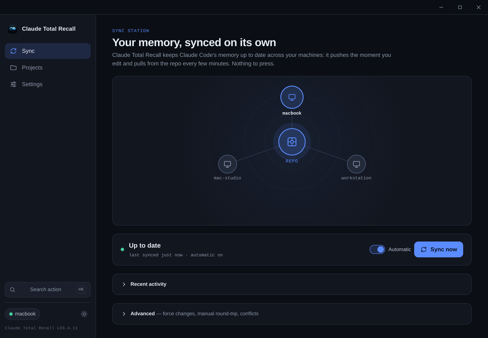
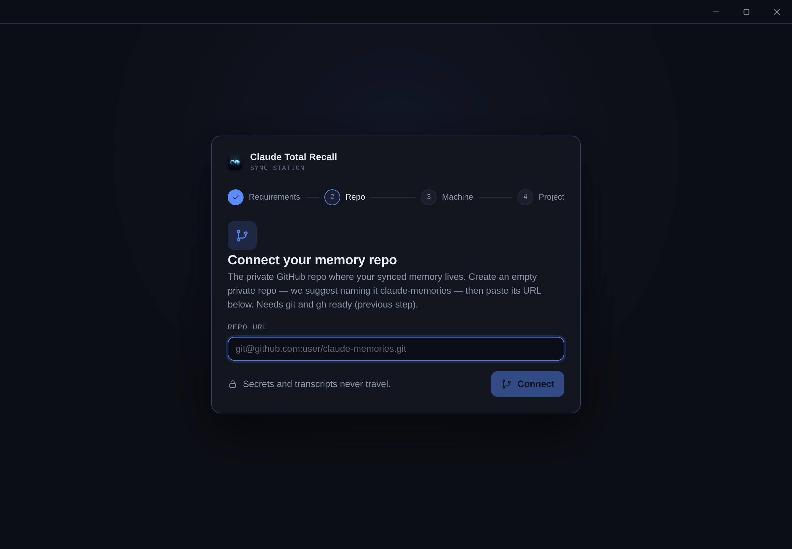
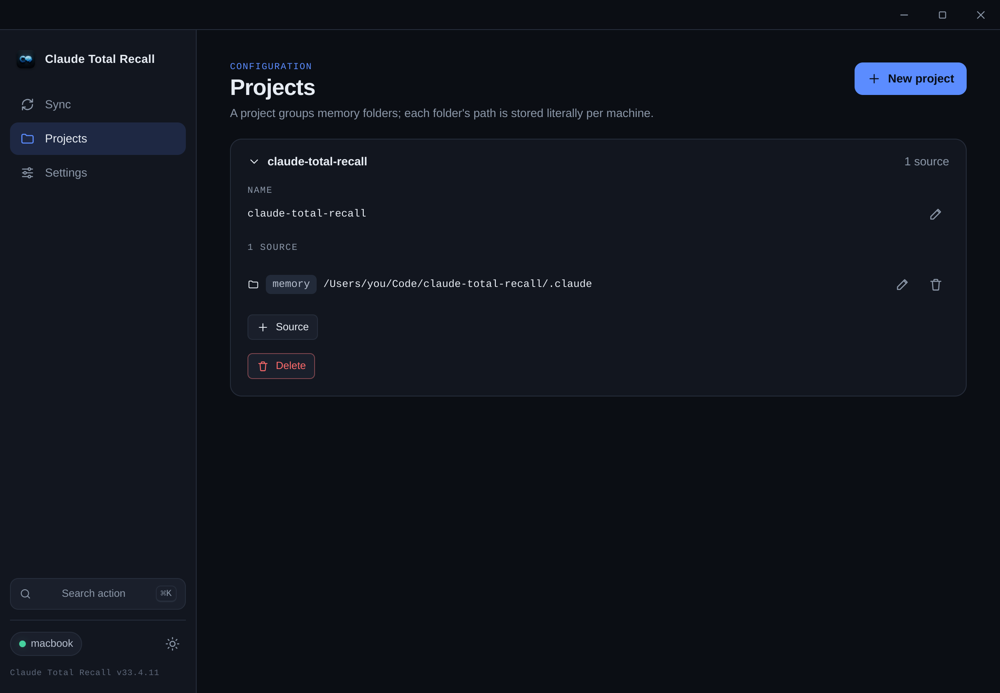

<p align="center">
  
</p>

<h1 align="center">Claude Total Recall</h1>

<p align="center">
  Sync your <b>Claude Code memory</b> across machines — and keep a private, versioned
  <b>backup</b> of it — through a GitHub repo you own.
</p>

<p align="center">
  <a href="LICENSE"></a>
  <a href="https://github.com/MrBurcha/ClaudeTotalRecall/releases/latest"></a>
  <a href="https://github.com/MrBurcha/ClaudeTotalRecall/actions/workflows/ci.yml"></a>
  
</p>

---

## What it is

Claude Code keeps its **memory** in `~/.claude`: your `CLAUDE.md` house rules, your custom
`commands/`, `agents/`, and `skills/`, and your `settings.json`. That state is valuable — and it
lives on one machine. Switch laptops, reinstall, or lose the disk, and it's gone.

**Claude Total Recall** gives you two things, backed by a **private GitHub repo you own**:

- **Sync across machines** — your Claude Code memory stays identical on every computer you use, kept
  up to date automatically while the app is open.
- **A versioned backup** — even on a _single_ machine, you get a full **git history** of your Claude
  Code setup in your own private repo. Roll back a bad edit, audit what changed, restore after a
  reinstall.

**Secrets never travel.** A hard guard always excludes `.credentials.json`, `.claude.json`, and
`*.jsonl` transcripts — regardless of configuration — with the memories repo's own `.gitignore` as a
second layer.

It's a desktop app (Electron) that auto-syncs in the background, plus a headless CLI that shares the
same core. **macOS and Linux** (Windows is deliberately deferred).

## Screenshots

<p align="center">
  
</p>

<p align="center">
  
  
</p>

## Install

Grab the latest build from the [**Releases**](https://github.com/MrBurcha/ClaudeTotalRecall/releases/latest)
page. Builds are **unsigned** (no paid Apple/OS code-signing) — see the notes below.

### macOS (Apple Silicon)

1. Download `Claude-Total-Recall-<version>-arm64.dmg`, open it, and drag the app to **Applications**.
2. First open, because the build isn't notarized (macOS 15 Sequoia and later — the old
   _right-click → Open_ was removed):
   - Double-click the app → _"Apple could not verify…"_ → **Done**.
   - **System Settings → Privacy & Security**, scroll to **Security** → _"Claude Total Recall was
     blocked…"_ → **Open Anyway** → confirm with Touch ID / password.

   Or clear the quarantine in one shot from a terminal:

   ```bash
   xattr -cr "/Applications/Claude Total Recall.app"
   ```

   > It's a one-time step. Opening with **no dialog at all** would require notarization with a paid
   > Apple Developer account.

### Linux

Pick the package for your distro:

```bash
# AppImage (portable — any distro)
chmod +x Claude-Total-Recall-<version>.AppImage
./Claude-Total-Recall-<version>.AppImage

# Debian / Ubuntu
sudo dpkg -i claude-total-recall_<version>_amd64.deb

# Arch
sudo pacman -U claude-total-recall-<version>.pacman
```

Prefer to build the binaries yourself? See [Build from source](#build-from-source).

## Quickstart

**You need:**

- **`git`** and **`gh`** (the [GitHub CLI](https://cli.github.com)) on your `PATH`, with `gh`
  authenticated: `gh auth login && gh auth setup-git`.
- An **empty private GitHub repo** to hold your memories — _separate from any code repo_. You don't
  have to initialize it; the app creates the structure on the first connect.

**Then, in the app:** on first launch an **onboarding wizard** walks you through it — connect the
memories repo, register this machine, and (optionally) add your first project. After that the
**Sync** screen keeps everything up to date on its own; **Advanced sync** exposes the manual
outgoing/incoming flow.

Prefer the terminal? The same flow via the CLI:

```bash
claude-total-recall check                       # preflight: git / gh / auth
claude-total-recall connect git@github.com:you/claude-memories.git
claude-total-recall register --name my-laptop
claude-total-recall outgoing                    # push this machine's memory to the repo
# …on another machine, after connect + register:
claude-total-recall incoming                    # pull the repo's memory onto this machine
```

**What syncs:** your user-level `~/.claude/CLAUDE.md`, `commands/`, `agents/`, `skills/`, and
`settings.json`, plus any **project memory folders** and **pinned files** you declare. Everything is
stored under logical names in `memories/…` inside your repo. For the full picture — what's **never**
synced, what's skipped on purpose, and how to back up a git-ignored `.env` — see
[**What gets synced (and what to back up)**](#what-gets-synced-and-what-to-back-up).

## CLI

The CLI ships the same core as the app and is English-only. Every command prints its result and sets
an exit code (`0` on success).

| Command                        | What it does                                                                                                                                                                  |
| ------------------------------ | ----------------------------------------------------------------------------------------------------------------------------------------------------------------------------- |
| `check`                        | Preflight: verifies `git` and `gh` are installed and `gh` is authenticated. Read-only.                                                                                        |
| `connect <remote>`             | Clone/initialize the memories repo into `~/.config/claudetr/repo` (accepts HTTPS, SSH, or `file://` remotes). On an empty repo it writes the initial structure and pushes it. |
| `status`                       | Local repo status: branch, ahead/behind, dirty, conflicts. Read-only.                                                                                                         |
| `register [--name <id>]`       | Register this machine in the repo config (defaults the id to your hostname). Mutates the repo.                                                                                |
| `outgoing [--dry-run] [--yes]` | **machine → repo**: build a Plan, then commit + pull + push your memory.                                                                                                      |
| `incoming [--dry-run] [--yes]` | **repo → machine**: pull first, build a Plan, then write the repo's memory onto this machine. Never touches the remote.                                                       |

Notes:

- `outgoing`/`incoming` build a **Plan (dry-run)** and ask for confirmation. `--dry-run` previews and
  touches nothing; `--yes` skips the prompt (**required** when running non-interactively, e.g. in a
  script).
- There is no per-subcommand `--help` and no version flag — `claude-total-recall` with no args (or
  `help`) prints the usage block.

Running the CLI from source: `npm run build:cli` produces `dist-cli/index.js`, then
`node dist-cli/index.js <command>`. The `check` shortcut is `npm run cli:check`.

## How it works

- **Every mutating action builds a Plan first** — a dry-run of typed actions (create / overwrite /
  delete / noop / skip) with content hashes, previewed before anything touches disk. Source hashes
  are re-validated at execution time (a TOCTOU guard).
- **Auto-sync while the app is open** — it pushes the moment a watched file changes and pulls from
  the repo on a periodic poll. The manual `outgoing`/`incoming` verbs live under **Advanced sync**.
- **`settings.json` is merged, not copied** — a shared base plus per-key machine-local overrides in
  `~/.config/claudetr/settings.local.json`. Local overrides win on incoming and never travel to the
  repo.
- **Conflicts are resolved per file** — `ours` (local) or `theirs` (remote), then finalize the merge.
- **Secrets are hard-excluded** — `.credentials.json`, `.claude.json`, `*.jsonl`, always.

## Keeping MEMORY.md in sync

`MEMORY.md` is the index of a memory store. When two machines held different
memories and then synced, the index can end up reflecting only the machine that
synced last — listing memories that aren't on disk, or missing ones that are.

If that happens, open Claude Code in the affected project and run this maintenance
pass to reconcile the index with the files on disk:

```
Do a maintenance pass on your memory store.
1. Reindex. Reconcile the MEMORY.md index against the memory files actually on disk: add any memory that exists but isn't indexed, remove index lines whose file is gone, and fix hooks that no longer match their file's content. Keep each hook faithful to what the memory actually says.
2. Find contradictions. Look for two kinds: memories that conflict with each other, and memories that conflict with current reality. For the second kind, verify claims against the actual repo/code/git before trusting them — a memory can have been correct when written but gone stale since. List everything you find and check with me before editing or deleting anything.
3. Reorganize if warranted. Merge duplicates, split overloaded memories, and fix miscategorized ones — but preserve the intentional split between "what this is / what happened" (project) memories and "how you should act" (feedback) memories; don't collapse those into each other. Ask before any destructive change.
4. Report a short summary of what you reindexed, which contradictions you found and how they were resolved, and what (if anything) you reorganized.
```

You only need this when machines genuinely diverged. If a `MEMORY.md` update is just
a reconciliation you already ran on another machine propagating over, it's already
consistent — no action needed. The app shows the same guidance in-app (next to a
received `MEMORY.md` in Recent activity, and when you add such a source on a second
machine).

## What gets synced (and what to back up)

Claude Total Recall does **not** mirror all of `~/.claude`. It syncs a **curated allowlist** — the
config and memory that's portable and worth carrying between machines — and deliberately leaves
behind everything that's machine-local, disposable, or secret. This section is the full picture:
what travels, what never does, and how to back up the odd file (like a git-ignored `.env`) you want
kept but out of your product repo.

> [!WARNING]
> **Keep your own local backups too — Claude Total Recall is a safety net, not your only copy.**
> Claude Code's internal file layout belongs to Anthropic and can change without notice: a future
> update could reshape, rename, or move these files in ways we can't anticipate or immediately
> support. The app syncs what it sees — it can't guarantee forward-compatibility with a third-party
> product's internals.
>
> The upside: because everything lives in a **private, versioned GitHub repo**, you always have git
> history to roll back to a known-good state if something breaks — that's your recovery hatch. Even
> so, a periodic local copy of `~/.claude` (a plain `cp -r`, a Time Machine / Timeshift snapshot, an
> archive) is cheap insurance, and the two together beat either one alone.

### Synced by default

| What                | Where it lives on disk                   | How it syncs                                                        |
| ------------------- | ---------------------------------------- | ------------------------------------------------------------------- |
| **House rules**     | `~/.claude/CLAUDE.md`                    | single file → `memories/user/CLAUDE.md`                             |
| **Custom commands** | `~/.claude/commands/`                    | folder, mirrored → `memories/user/commands/`                        |
| **Subagents**       | `~/.claude/agents/`                      | folder, mirrored → `memories/user/agents/`                          |
| **Skills**          | `~/.claude/skills/`                      | folder, mirrored → `memories/user/skills/`                          |
| **Settings**        | `~/.claude/settings.json`                | **merged**, not copied — machine-local keys stay local (see below)  |
| **Project memory**  | any folder(s) you declare, per project   | folder mirror _or_ single file → `memories/projects/<name>/<slot>/` |
| **Pinned files**    | any single file, anywhere on the machine | **Settings → Pinned files** → `memories/pinned/<name>`              |

`settings.json` is the one exception to plain copying: a shared base is merged with per-key
machine-local overrides you declare in `~/.config/claudetr/settings.local.json`. Those local keys
(paths, per-machine toggles) **never travel to the repo**, and win on the way back in.

**Recommended project source:** point a project at `~/.claude/projects/<project-slug>/memory/` — the
auto-memory Claude writes per project. The session transcripts sitting next to it
(`~/.claude/projects/<slug>/*.jsonl`) are excluded automatically (see below), so only the memory
travels.

### Never synced — hard-excluded

These are blocked in **every** Plan and can't be re-enabled by any configuration:

| Pattern             | Why it's blocked                                              |
| ------------------- | ------------------------------------------------------------- |
| `.credentials.json` | your Claude auth tokens                                       |
| `.claude.json`      | local Claude config — can carry MCP tokens and other secrets  |
| `*.jsonl`           | session transcripts — large, per-machine, and often sensitive |

Defense in depth: a guard runs before anything enters a Plan **and** the memories repo ships a
`.gitignore` covering the same patterns, so a stray file can't slip in even by accident.

### Local state we skip on purpose

Everything else under `~/.claude` is machine-local runtime state, caches, and history — there's no
value (and sometimes real risk) in syncing it, so the app never touches it. That includes
`sessions/`, `history.jsonl`, the per-project `projects/<slug>/` transcripts, `security/`,
`daemon/`, `shell-snapshots/`, `file-history/`, `downloads/`, `session-env/`, `tasks/`, and the
various `*-cache/` directories. If you want a full-disk safety copy of these anyway, that's what the
**local backup** above is for — not this app.

### Backing up secrets you keep out of a repo (e.g. `.env`)

A common case: a `.env` that's **git-ignored in your product repo**, but that you still want backed
up and mirrored to your other machines. Two ways to opt it in:

- **Pin it** — **Settings → Pinned files** → choose the `.env`. It syncs globally to
  `memories/pinned/<name>`, independent of any project.
- **Add it as a project _file_ source** — when adding a source, pick **file** (not folder) and point
  it at the `.env`.

Unlike credentials, `.env` is **not** on the hard-excluded list — that's deliberate, so you _can_
choose to back it up. But it also means the app won't stop you, and the responsibility is yours:

> [!CAUTION]
>
> - Your memories repo **must be private** — anyone with read access sees the file in the clear.
> - The secret lands in **git history in plaintext**; removing it later does **not** erase it from
>   past commits (you'd need a history rewrite).
> - **Rotate** the secret if the repo is ever exposed.
> - For teams or production, prefer a real secrets manager (1Password, Vault, a cloud secret store)
>   over versioning secrets at all.

## Build from source

**Requirements:** [Node.js 20](https://nodejs.org), plus `git` and `gh` as above.

```bash
git clone https://github.com/MrBurcha/ClaudeTotalRecall.git
cd ClaudeTotalRecall
npm install
npm run dev          # run the Electron app in dev mode
```

| Script                | Does                                                           |
| --------------------- | -------------------------------------------------------------- |
| `npm run dev`         | Run the app in dev mode (electron-vite).                       |
| `npm test`            | Run the test suite (vitest).                                   |
| `npm run typecheck`   | `tsc --noEmit`.                                                |
| `npm run lint`        | ESLint.                                                        |
| `npm run build:cli`   | Build the headless CLI → `dist-cli/index.js`.                  |
| `npm run build:mac`   | Unsigned `.dmg` → `release/` (**run on macOS**).               |
| `npm run build:linux` | AppImage + deb + pacman → `release/` (**run on Linux or CI**). |

**No cross-build:** `build:mac` must run on macOS and `build:linux` on Linux. Pushing a `v*.*.*` tag
runs [`.github/workflows/release.yml`](.github/workflows/release.yml), which builds the artifacts on
macOS + Linux runners and publishes a GitHub Release.

## Architecture

```
src/core/       pure logic (config, plan, outgoing/incoming, git wrapper, service,
                preflight, sync engine, conflict resolution, settings merge, typed errors).
                No Electron imports — tests run directly under Node.
src/platform/   the only OS-specific code (linux/macos adapter).
src/cli/        headless entrypoint (English-only).
src/main/       Electron bootstrap + IPC + preload + auto-sync scheduler + frameless window.
src/renderer/   React UI (AppShell + screens/ + features/) with i18n/ for the bilingual catalog.
```

The renderer UI is **bilingual** — English (source) and neutral Latin American Spanish (es-419) —
defaulting to your host locale and switchable in **Settings → Language**.

## Platform support

**macOS and Linux.** Windows is deliberately deferred (the platform layer is the only OS-specific
code, so adding it is one more adapter).

## Roadmap

- Automatic project discovery
- In-app 3-way merge editor
- Per-project timestamps
- Create the memories repo from the app
- Windows support

## Contributing

Contributions are welcome — see [CONTRIBUTING.md](CONTRIBUTING.md) for the dev setup, testing, and
release process.

## Security

The app is built around never syncing secrets. If you find a security issue, please see
[SECURITY.md](SECURITY.md).

## License

[MIT](LICENSE) © MrBurcha
